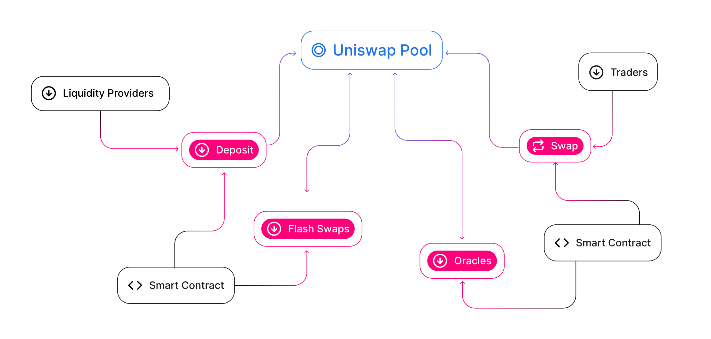

+++
weight = 10
+++

## Agenda

1. [What is Uniswap?](#what-is-uniswap)
1. [Background](#background-1x)
1. [Actors](#actors)
1. [How does it work](#how-does-it-work)
   1. Constant Product AMM
   1. Pricing
   1. Deposit with only one token
1. SwapRouter ABI
1. [Blockchain-native](#blockchain-native)

---

## What is Uniswap?

Uniswap is a [decentralized](#decentralised-12) automated market maker ([AMM](#background-1x)) **protocol** that allows anyone to swap **token** A for token B

<small>- roherrera.eth@[source](https://mirror.xyz/roherrera.eth/BMg6IoBHO8fNuyvmAuSDqjWf3ur-YZEAsNyG-aA1f9Y)</small>

---

### Decentralised (1/2)

<small>
> What does this mean? To what extent?
</small>

Bottom up approach, traditional client-server architecture lens:

{}

- Infrastructure

  High number of nodes participating in p2p network. Nodes store records and host the system logic.

{}



{}

- Transaction processing

  Transaction logic is processed at the blockchain level, meaning multiple clients execute the code and come to consensus.

{}



---

### Decentralised (2/2)

{}

- User interface

  While Uniswap's official UI is hosted by a US company, anyone can run this frontend locally - the [dApp code is OSS](https://github.com/Uniswap/interface).

  - UI has also been deployed to IPFS

{}

{}

Only requires connection to a node.

{}



---

### Beyond Decentralised

{}

#### Permissionless

<small>
> What does this mean? To what extent?
</small>

{}

{}

- Who is allowed to participate?

  Any Ethereum account can perform swaps or provide liquidity. ✅

{}

{}

#### Immutable

No party is able to pause the contracts or reverse trade execution.

{}

{}

#### Governable

Uniswap Governance has the right (but no obligation) to divert a percentage of swap fees

{}

---

## Background (1/x)

{} Uniswap v1 - 2018. {}
{} Can only pair ERC20-ETH. No token-to-token "directly". {}
{} Can still be done in the same tx, but had to route through an ETH pair. {}

{}
Uni V3 defines [Range Orders](https://docs.uniswap.org/protocol/concepts/V3-overview/range-orders#buy-limit-orders), but in fact, it is still not a **CLOB**. [Its creators tout it](https://twitter.com/danrobinson/status/1504867385009852419?s=20&t=Gm0NAAlzU5Yt9huMjuSgcQ) as a hybrid between AMM and CLOB.
{}

{}
When **market makers** add liquidity, they get a "liquidity pool share"<small>[wp](https://uniswap.org/whitepaper.pdf)</small> token.
{}

---

{}

## Background (2/x)

1. **A**utomated **M**arket **M**aking
1. **C**entralised **L**imit **O**rder **B**ook
1. **R**equest **f**or **Q**uotation

   

They're all types of exchanges.

---

### AMM, CLOB, what?

{} \2. **C**entralised **L**imit **O**rder **B**ook {}

{} Most commonly used exchange methodology. Collects orders from market makers and then publishes an aggregate order book.  Examples: NYSE, CBOT, Coinbase, Binance. {}

---

### AMM, CLOB, what?

{} \1. **A**utomated **M**arket **M**aking {}

{} Mostly seen in research and prediction markets. Uniswap's innovation comes from developing a “constant function market making” system (CFMMs) - More specifically a CPMM. (Yes, more terms!) Examples: Uniswap, Bancor, Curve. {}

---

### AMM, CLOB, what?

{} \3. **R**equest **f**or **Q**uotation {}

{} A taker initiates a transaction by querying a known set of market makers with a specific demand (e.g. “buy 10 ETH”) Taker receives a quote from each, and decides which (if any) to accept.  Examples: Airswap, Kyber, 0x. {}

---

## Background (6/6)

End of AMM intro.

Sources:

- Hummingbot [blog](https://hummingbot.io/en/blog/2019-04-crypto-exchange-types)
- "Constant Function Market Makers: DeFi’s “Zero to One” Innovation" [Medium article](https://medium.com/bollinger-investment-group/constant-function-market-makers-defis-zero-to-one-innovation-968f77022159)

{}

---

## Actors

Who provides liquidity to the system ?

<small>[source](https://docs.uniswap.org/protocol/V2/concepts/protocol-overview/ecosystem-participants)</small>

<!-- Why would someone provide liquidity to the system ?: Point to docs, otherwise will overextend -->

---



## How does it work?

 

### x\*y = k

      

---

### Back to CPMM

<!-- Displayed equations are wrapped in double-\$
Inline equations like $E=mc^2$ are wrapped in single-\$ -->

$${x}*{y} = {k}$$

    
Means that when a Liquidity pool is deployed, initial $k$ is set based on the amounts of $x$ and $y$ deposited.

Liquidity providers (LP) will receive LP tokens to represent share in pool.

This also means that because the product needs to remain constant\*, the universe of prices will be the resulting curve.

<!-- Constant ... actually non-depletable -->

---

### Pricing (1/x)

---

### Pricing (2/x)

- Spot (a.k.a Marginal, Mid) Price: The price represented by the status of the reserves.

  $${P} = \frac{x}{y}$$

- Execution Price: The average price for an executed trade. Below formula calculates how much of ${y}$ a trader will get, given input $\Delta{x}$

  $${\Delta{y}} = {y}*(1-{f})\Delta{x} / ({x} + (1-{f})\Delta{x})$$
  ${f}$ is the fee, which for Uni v2 sits at 0.3% for all pairs.

---

### Pricing (3/x)

---

---

## SwapRouter ABI

---

## Blockchain-native

### Flashswaps

Withdraw up to the full reserves of any ERC20 token on Uniswap and **execute arbitrary logic** at no upfront cost, provided that by the end of the transaction you either:

- pay for the withdrawn ERC20 tokens with the corresponding pair tokens
- return the withdrawn ERC20 tokens along with a small fee

---

# THE END

How does Uniswap’s pricing mechanism work ?

How does the system represents the liquidity ?

Can you provide liquidity with only 1 side of the pair?
